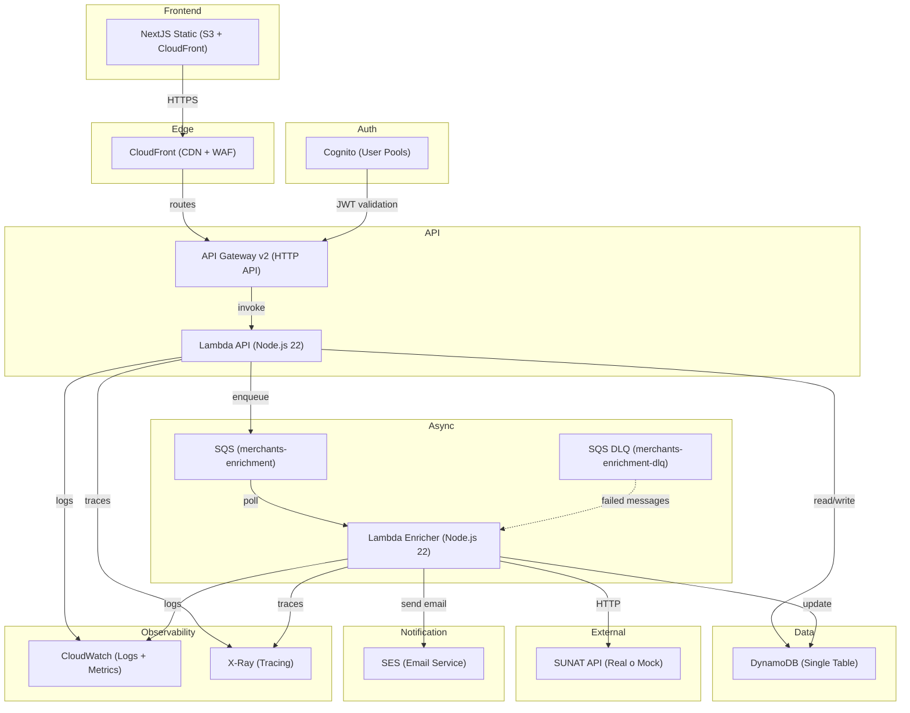
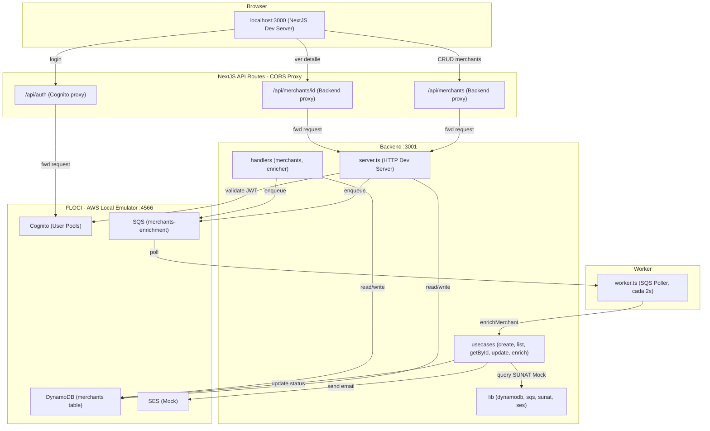
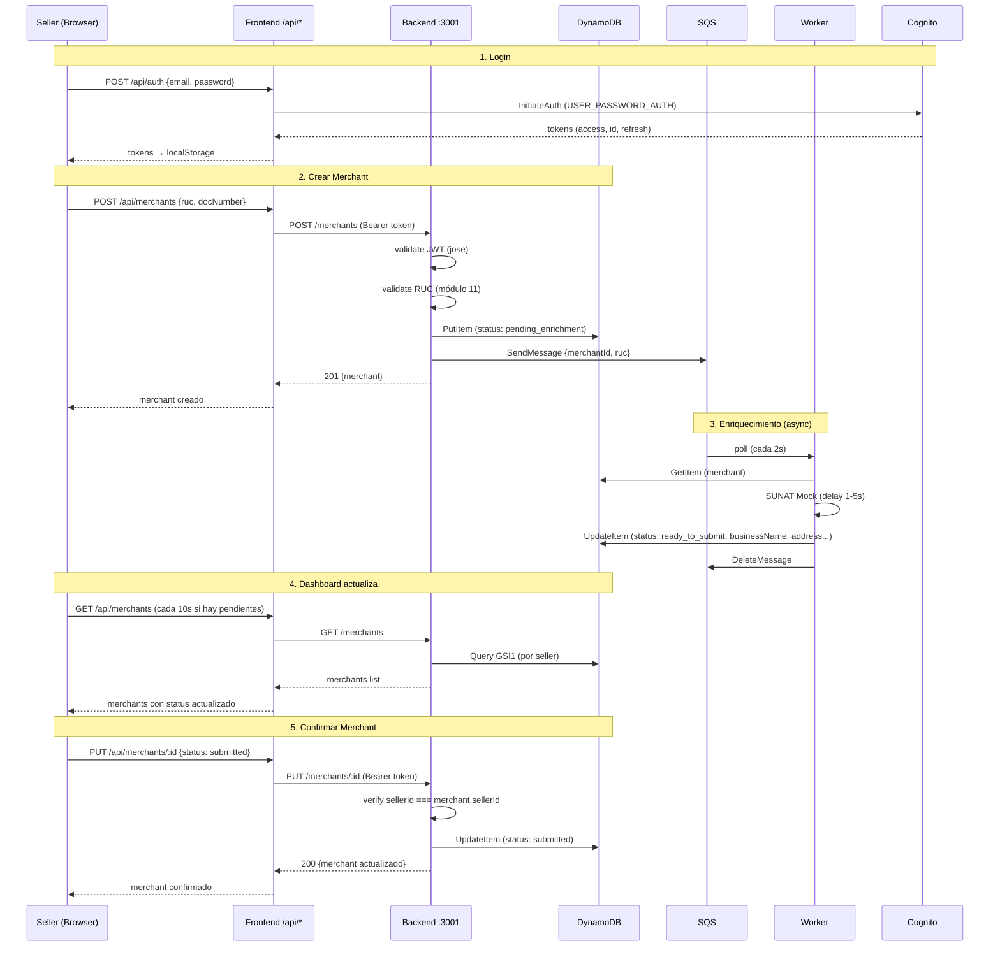

# Arquitectura — Mini Onboarding

## Diagrama de Producción



## Diagrama de Desarrollo (FLOCI)



### Arquitectura de Desarrollo — Explicación

El entorno de desarrollo replica la arquitectura de producción usando FLOCI como emulador de AWS. Cada componente de producción tiene su equivalente local:

| Producción | Desarrollo | Puerto | Descripción |
|------------|-----------|--------|-------------|
| CloudFront + S3 | NextJS Dev Server | 3000 | Frontend con hot-reload |
| API Gateway | API Routes `/api/*` | 3000 | Proxy CORS (same-origin) |
| Cognito | FLOCI Cognito | 4566 | User Pool + Client + Users |
| Lambda API | Backend Dev Server | 3001 | HTTP server con hot-reload |
| Lambda Enricher | SQS Worker | — | Poller cada 2s |
| DynamoDB | FLOCI DynamoDB | 4566 | Single table + 2 GSIs |
| SQS | FLOCI SQS | 4566 | Cola merchants-enrichment |
| SES | FLOCI SES | 4566 | Mock (no envía emails reales) |
| SUNAT API | SUNAT Mock (`lib/sunat.ts`) | — | Delay 1-5s, datos fake |

### CORS Strategy — API Routes Proxy

El frontend nunca llama directamente a servicios externos. Todas las peticiones pasan por API Routes de Next.js que actúan como proxy server-side:

```
Browser → /api/auth (same-origin) → FLOCI Cognito (server-side)
Browser → /api/merchants (same-origin) → Backend :3001 (server-side)
Browser → /api/merchants/:id (same-origin) → Backend :3001 (server-side)
```

**¿Por qué?**
- FLOCI no envía headers CORS → el browser bloquea las peticiones cross-origin
- El Client ID de Cognito no debe exponerse al cliente (seguridad)
- El proxy centraliza la configuración de endpoints

### Data Flow Completo



## Flujo Principal (Producción)

### 1. Login del Seller

```
Seller → Frontend → Cognito (login)
Cognito → tokens (accessToken, refreshToken)
Frontend → almacena tokens en memoria
```

### 2. Creación de Merchant

```
Seller → Frontend → POST /merchants {ruc}
Frontend → Authorization: Bearer <token>
API Gateway → valida JWT (Cognito Authorizer)
API Gateway → Lambda createMerchant
Lambda → valida RUC (módulo 11) → sync
Lambda → DynamoDB: put merchant (status: pending_enrichment)
Lambda → SQS: sendMessage {merchantId, ruc}
Lambda → 201 {merchant, status: "pending_enrichment"}
Frontend → muestra "Enriqueciendo datos..."
```

### 3. Enriquecimiento Asíncrono

```
SQS → Lambda enricher (poll)
Lambda enricher → SUNAT Mock (delay 1-5s, simula latencia real)
Lambda enricher → DynamoDB: update merchant (status: ready_to_submit)
Lambda enricher → SES: send email "Datos listos"
Lambda enricher → SQS: deleteMessage
```

> **Nota**: La API de SUNAT se encuentra mockeada con un delay de 1-5 segundos para simular la latencia real de la API de SUNAT. En producción, se conectaría a la API real de SUNAT.

### 4. Confirmación del Seller

```
Seller → Frontend → ve merchant enriquecido
Seller → Frontend → PUT /merchants/:id {status: "submitted"}
Lambda → verifica sellerId del JWT === merchant.sellerId
Lambda → actualiza status: submitted
Lambda → respuesta 200 OK
```

## Setup de Desarrollo

### Prerrequisitos

- Docker Desktop
- pnpm

### Inicio rápido

```bash
# 1. Levantar FLOCI
docker compose up floci -d

# 2. Setup completo (Cognito + DynamoDB + SQS + seed data)
make setup

# 3. Levantar todos los servicios
docker compose up -d

# 4. Abrir http://localhost:3000/login
#    Email: seller@test.com
#    Password: Seller123!
```

### Servicios

| Servicio | Puerto | Comando |
|----------|--------|---------|
| Frontend (NextJS) | 3000 | `docker compose up frontend` |
| Backend (HTTP server) | 3001 | `docker compose up backend` |
| FLOCI (AWS emulator) | 4566 | `docker compose up floci` |
| Worker (SQS poller) | — | `docker compose up worker` |
| AWS CLI | — | `docker compose run --rm awscli <cmd>` |

### Comandos útiles

```bash
make setup         # Setup completo de FLOCI
make db-setup      # Solo DynamoDB + SQS
make db-seed       # Datos de prueba
make db-shell      # Ver merchants en DynamoDB
make cognito-setup # Solo Cognito
make test-unit     # 84 tests unitarios
make test-frontend # 10 tests frontend
make test-integration # 11 tests integración (requiere backend corriendo)
```

### Datos de prueba

| Campo | Valor |
|-------|-------|
| Email | `seller@test.com` |
| Password | `Seller123!` |
| Seller mock (AUTH_MOCK) | `seller-dev-001` |

## Servicios AWS Utilizados

| Servicio       | Uso                       | Justificación                       |
| -------------- | ------------------------- | ----------------------------------- |
| CloudFront     | CDN, cache, WAF           | Velocidad global, seguridad en edge |
| S3             | Hosting frontend estático | Costo mínimo, alta disponibilidad   |
| Cognito        | Autenticación             | JWT nativo, MFA, social login       |
| API Gateway v2 | HTTP API + routing        | Integración nativa Lambda + Cognito |
| Lambda         | Compute serverless        | Auto-scale, pay-per-request         |
| DynamoDB       | Base de datos             | NoSQL, escalable, GSIs              |
| SQS            | Cola de mensajes          | Desacoplamiento, DLQ, reintentos    |
| SES            | Email transaccional       | Barato, nativo AWS                  |
| CloudWatch     | Logs y métricas           | Observabilidad nativa               |
| X-Ray          | Tracing distribuido       | Visibilidad end-to-end              |
| WAF            | Web Application Firewall  | Protección OWASP Top 10             |

## ¿Por qué Serverless?

**Toda la arquitectura es serverless.** No hay un solo servidor que administrar.

| Capa      | Servicio Serverless  | Alternativa no-serverless (descartada) |
| --------- | -------------------- | -------------------------------------- |
| Compute   | Lambda               | EC2 ($70+/mes)                         |
| API       | API Gateway v2       | ALB + EC2 ($86+/mes)                   |
| Database  | DynamoDB (on-demand) | RDS ($15+/mes)                         |
| Messaging | SQS                  | RabbitMQ en EC2                        |
| Auth      | Cognito              | Keycloak en EC2                        |
| Hosting   | S3 + CloudFront      | Nginx en EC2                           |
| Email     | SES                  | SMTP en servidor                       |

### Comparación de costos

```
Serverless (nuestro caso):
  Lambda:      $2.50/mes  (10K requests)
  DynamoDB:    $0.04/mes  (on-demand)
  API Gateway: $0.01/mes  (10K requests)
  SQS:         $0.0002/mes
  Cognito:     $0.55/mes  (100 MAU)
  SES:         $0.05/mes  (500 emails)
  WAF:         $15.00/mes
  TOTAL:       ~$18/mes

No-serverless equivalente:
  EC2 t3.micro:  $70/mes (24/7)
  RDS t3.micro:  $15/mes (24/7)
  ALB:           $16/mes (mínimo)
  TOTAL:         ~$101/mes
```

**Ahorro: ~82% con serverless.**

### Trade-offs aceptados

| Aspecto        | Serverless              | No-serverless   |
| -------------- | ----------------------- | --------------- |
| Cold starts    | 200ms-1s                | Sin cold starts |
| Vendor lock-in | SDK AWS                 | Portable        |
| Limits         | 15min timeout, 10GB RAM | Sin limits      |
| Debugging      | X-Ray + CloudWatch      | SSH al servidor |

**Decisión**: Los cold starts son aceptables — el seller no notará 200ms extra. Si escalamos a 10K+ requests/hora, reconsideraríamos.

Ver [ADR-007: Serverless](adr/007-serverless-architecture.md) para el análisis completo.

## Decisiones Clave de Arquitectura

1. **100% Serverless**: Zero ops, pago por uso, auto-scale automático.

1. **Single-table DynamoDB**: Una sola tabla con GSIs para todos los access patterns. Evita joins y reduce latency.

1. **SQS Standard (no FIFO)**: No necesitamos ordering por merchant. Standard es más barato y tiene mejor throughput.

1. **Lambda synchronous + async**: El createMerchant es síncrono (respuesta inmediata). El enricher es asíncrono (background).

1. **Cognito Authorizer en API Gateway**: La validación JWT ocurre en edge, no en Lambda. Reduce cold starts.

1. **Static frontend**: NextJS exporta HTML. No hay servidor. S3 + CloudFront. Costo mínimo.

1. **FLOCI para desarrollo**: LocalStack está sunset. FLOCI es más rápido y siempre free.

## Blast Radius

| Escenario     | Impacto                            | Mitigación                              |
| ------------- | ---------------------------------- | --------------------------------------- |
| DynamoDB cae  | No se crean ni leen merchants      | DynamoDB replicas automáticas           |
| SQS cae       | No se enriquecen merchants         | DLQ retiene mensajes, retry manual      |
| SUNAT API cae | Enrichment falla, retry automático | Mock con delay, MaxReceiveCount: 3, DLQ |
| SES cae       | No se envían emails                | Retry automático, fallback a console    |
| Lambda falla  | Request falla                      | API Gateway retry, DLQ para async       |
| Cognito cae   | No se puede login                  | Multi-region si es crítico              |
